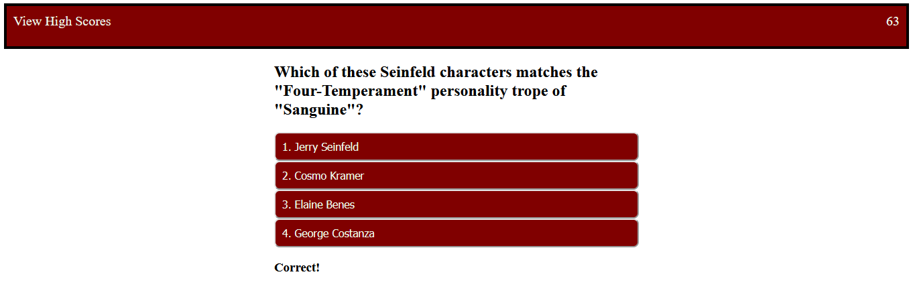

# Rand H Quiz Game

## Description
Hello! This deployed webpage is a short quiz of many topics. The quiz starts when the User presses the "INTITIATE" button in the center of the page. A timer counts down each second and displays its value at the top right of the page. When the timer reaches 0 or the User answers every question, the game ends. The User's score is equal to the time remaining, and is displayed to the User along with a form field to submit their initials to add to the High Score board. The text in the top left that reads "View High Scores" can also be clicked to see existing high scores. Additionally, these values are stored in local storage.


## Table of Contents
* [Technologies Used](#technologies-used)
* [How to Access](#how-to-access)
* [What I Did](#what-i-did)
* [Code Snippets](#code-snippets)
* [Screenshots](#screenshots)
* [Acknowledgments](#acknowledgments*)
* [Who I Am](#who-i-am)

---

## Technologies Used
* [HTML](https://www.w3schools.com/html/) to structure the "skeleton" of the webpage and its elements.
* [CSS](https://www.w3schools.com/css/) for visual styling to make that HTML much prettier.
* [Javascript](https://www.javascript.com/) to develop the algorithms included in this web application.
* [Git](https://git-scm.com/) for distributed version control, tracking changes over time and making them visible to collaborators.
* [Github](https://github.com/) for version control in the cloud, saving my changes and presenting them clearly to myself and others.

## How to Access
* [Click here](https://prophetrand.github.io/lucky-quiz-game/) to view the deployed Quiz Game.

---

## What I Did
I used Javascript to traverse the DOM in order to create and modify HTML for the webpage. The principle technique I used to do so was a three-step process: 
1. Create pointers with variables to store document object elements, referenced with unique IDs in the HTML, such as document.getElementById("timer").
2. Create event listeners that delegate a function to specific element.
3. Write functions to do work on/using those elements, populating them with stuff, mess with their parents/children, changing their text, or updating the values of global variables.

These steps provided the structure for how the Javascript code manipulates the HTML elements. The rest of the functionality stems from the logic written in the rest of the Javascript. I also included a CSS stylesheet to make the application more presentable.

## Code Snippets 
The snippet below shows the structure of the question contents and functions. When runQuestion3() is called, it first clears the event listener that had been established by the previous question. The questionText and answer button contents are declared, and then an event listener is created that listens for a click on any of the buttons, which then calls the function bigQ3().

bigQ3() checks if the event.target, which represents each individual button, has a parent element whose value matches the number "2", which represents the correct answer for this question. The parent elements of the four answer buttons are divisions with value properties equal to 1, 2, 3, and 4. The check performed in bigQ3() compares that value to the establish correct number and displays "Correct!" if correct, and "Incorrect! -10 seconds..." otherwise. An incorrect response also decreases the timeLeft counter by 10. Very brutal.

Every other question matches this scheme, with the exception of the first question being called by the game starting, and the final question calling gameOver() instead of continuing the game.
```
function runQuestion3(){
    answerEvent.removeEventListener("click", bigQ2);
    
    questionText.textContent = 'Which of these Seinfeld characters matches the "Four-Temperament" personality trope of "Sanguine"?';

    answer1.textContent = "1. Jerry Seinfeld";
    answer2.textContent = "2. Cosmo Kramer";
    answer3.textContent = "3. Elaine Benes";
    answer4.textContent = "4. George Costanza";

    answerEvent.addEventListener("click", bigQ3);
}

function bigQ3(event){
    var choice = event.target;
    if (choice.parentElement.getAttribute("value") === "2"){
        message.textContent = "Correct!";
    } else {
        message.textContent = "Incorrect! -10 seconds...";
        timeLeft -= 10;
    }
    runQuestion4();
}
```

## Screenshots
The game is visualized in the screenshot below. As the timer counts down it displays in the top right corner. The question and its corresponding answer buttons populate the center of the page. The buttons are assigned an eventListener that executes when any of the buttons is clicked, but an if/else tree checks if their answer matches the correct value and displays an appropriate message.


---

## Acknowledgments
* [W3Schools](https://www.w3schools.com/) has been my go-to for descriptive tutorials on HTML, CSS, and Javascript syntax and best practices. I am eternally grateful for their massive store of documentation.


## Who I Am
My name is Rand Hale, and I am an aspiring programmer/web developer based in California.

* [LinkedIn](https://www.linkedin.com/in/rand-hale-83ba389b/)
* [Portfolio](https://prophetrand.github.io/my-responsive-portfolio/)